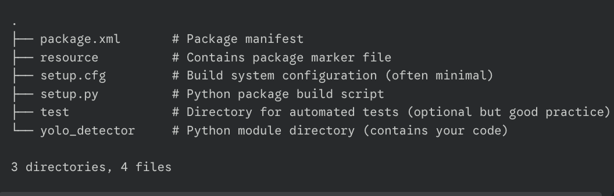
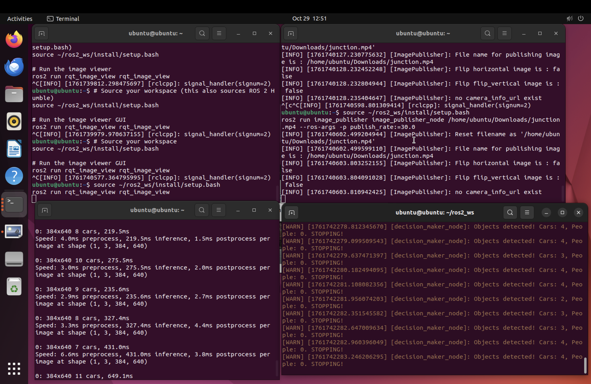
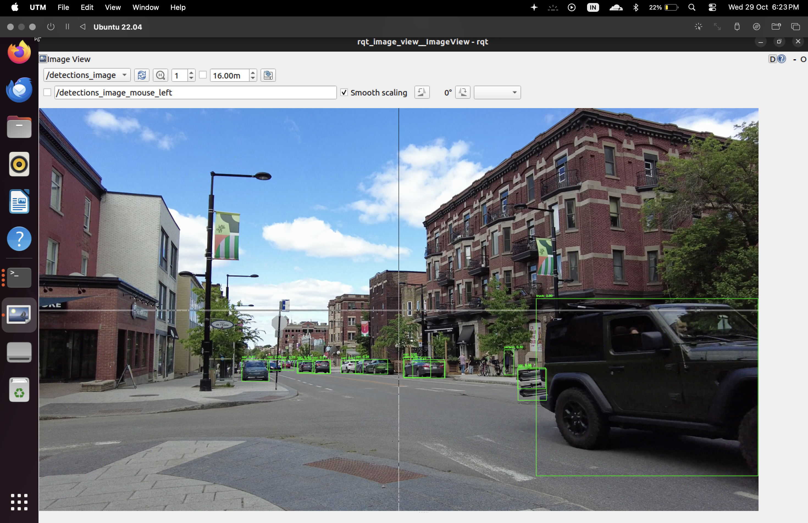

# ROS 2 YOLOv8 Detector Package

[](https://opensource.org/licenses/MIT)

A simplified ROS 2 Humble package demonstrating real-time object detection using YOLOv8 (from Ultralytics) and basic decision-making based on detections.

## Overview

This package contains two primary nodes:

1.  **`yolo_node`**: Subscribes to raw image topics, performs object detection using a YOLOv8 model, and publishes both the annotated debug image and structured detection data (bounding boxes, classes, scores).
2.  **`decision_maker`**: Subscribes to the structured detection data and logs simple decisions (e.g., "STOPPING" if objects are detected, "Moving forward" otherwise).

This serves as a basic template for integrating YOLO object detection into a ROS 2 perception pipeline.

## Features

* Utilizes the `ultralytics` Python library for YOLOv8 inference.
* Publishes standard `sensor_msgs/msg/Image` for debug visualization.
* Publishes standard `vision_msgs/msg/Detection2DArray` for structured detection data.
* Includes a simple decision-making node example.
* Configurable model path and confidence thresholds via ROS 2 parameters.


## Prerequisites

* **ROS 2 Humble Hawksbill:** Installed (Ubuntu 22.04 recommended).
* **Python 3:** (Should come with ROS 2 installation).
* **Required Python Packages:**
    ```bash
    pip install ultralytics opencv-python cv_bridge # cv_bridge might be via rosdep
    ```
* **ROS 2 Packages:** Ensure `vision_msgs` is installed:
    ```bash
    sudo apt update
    sudo apt install ros-humble-vision-msgs ros-humble-image-publisher ros-humble-rqt-image-view
    ```
* **YOLOv8 Model File:** Download a model (e.g., `yolov8n.pt`) from [Ultralytics](https://github.com/ultralytics/ultralytics) and ensure it's accessible by the `yolo_node`. By default, it looks for `yolov8n.pt` in the directory where the node is run.

## Tree


## Setup


1.  **Clone the Repository:**
    ```bash
    # Navigate to your ROS 2 workspace source directory
    cd ~/ros2_ws/src
    # Clone this repository (replace URL with your actual repo URL)
    git clone <your-repository-url-here> yolo_detector 
    cd .. 
    ```

2.  **Install Dependencies:**
    ```bash
    # Update rosdep
    rosdep update
    # Install dependencies listed in package.xml
    rosdep install --from-paths src --ignore-src -r -y
    # Install Python packages (if not already installed)
    pip install ultralytics opencv-python
    ```

3.  **Build the Workspace:**
    ```bash
    cd ~/ros2_ws
    colcon build --packages-select yolo_detector
    ```

## Running the Demo

This demo uses a pre-recorded video file. Ensure you have a video file (e.g., `/home/ubuntu/Downloads/junction.mp4`).

**IMPORTANT:** Open each command in a **new terminal**. Source the workspace in each terminal *before* running the command: `source ~/ros2_ws/install/setup.bash` (or add this line to your `~/.bashrc`).

1.  **Terminal 1: Start the Image Viewer**
    ```bash
    ros2 run rqt_image_view rqt_image_view
    ```
    *In the GUI, select `/detections_image` from the topic dropdown.*

2.  **Terminal 2: Start the Video Publisher**
    ```bash
    # Replace with the actual path to your video file
    ros2 run image_publisher image_publisher_node /path/to/your/video.mp4 --ros-args -p publish_rate:=30.0
    ```

3.  **Terminal 3: Start the YOLO Detector Node**
    ```bash
    ros2 run yolo_detector yolo_node
    ```
    *You can override parameters:*
    ```bash
    # Example: Use yolov8s model with 60% confidence threshold
    # ros2 run yolo_detector yolo_node --ros-args -p model_path:='yolov8s.pt' -p confidence_threshold:=0.60
    ```

4.  **Terminal 4: Start the Decision Maker Node**
    ```bash
    ros2 run yolo_detector decision_maker
    ```
    *You can override the decision confidence:*
    ```bash
    # Example: Only trigger STOP if confidence > 70%
    # ros2 run yolo_detector decision_maker --ros-args -p min_confidence:=0.70
    ```

You should see the annotated video in RQT Image View and decision messages ("STOPPING" or "Moving forward") printed in Terminal 4.

## Terminal view


## Live detection view using rqt image


## Nodes

* **`/yolo_detector_node` (`yolo_node`)**
    * Subscribes: `/image_raw` (`sensor_msgs/msg/Image`) - Input video frames.
    * Publishes: `/detections_image` (`sensor_msgs/msg/Image`) - Input video with bounding boxes drawn.
    * Publishes: `/detections` (`vision_msgs/msg/Detection2DArray`) - Structured detection data.
    * Parameters:
        * `model_path` (string, default: `yolov8n.pt`): Path to the YOLOv8 model file (`.pt`).
        * `confidence_threshold` (double, default: `0.5`): Minimum confidence score for YOLO detections.
* **`/decision_maker_node` (`decision_maker`)**
    * Subscribes: `/detections` (`vision_msgs/msg/Detection2DArray`) - Structured detection data.
    * Parameters:
        * `min_confidence` (double, default: `0.50`): Minimum confidence score for a detection to trigger the "STOPPING" decision.

## Topics

* `/image_raw`: Raw input video frames (published by `image_publisher_node` or a camera driver).
* `/detections_image`: Debug image with bounding boxes drawn (published by `yolo_node`).
* `/detections`: Structured detection data including bounding boxes, class names, and scores (published by `yolo_node`).

## Customization

* **Model:** Change the `model_path` parameter for `yolo_node` to use different YOLOv8 models (e.g., `yolov8s.pt`, `yolov8m.pt`). Larger models are more accurate but slower.
* **Thresholds:** Adjust the `confidence_threshold` parameter for `yolo_node` and the `min_confidence` parameter for `decision_maker` to tune sensitivity.
* **Input Source:** Replace the `image_publisher_node` with a camera driver node (like `v4l2_camera`) publishing to `/image_raw` to run on a live feed.
* **Decision Logic:** Modify `decision_maker.py` to implement more complex robot behavior based on the detected objects.

## License

This project is licensed under the MIT License - see the [LICENSE](LICENSE) file for details (or state the license directly).
